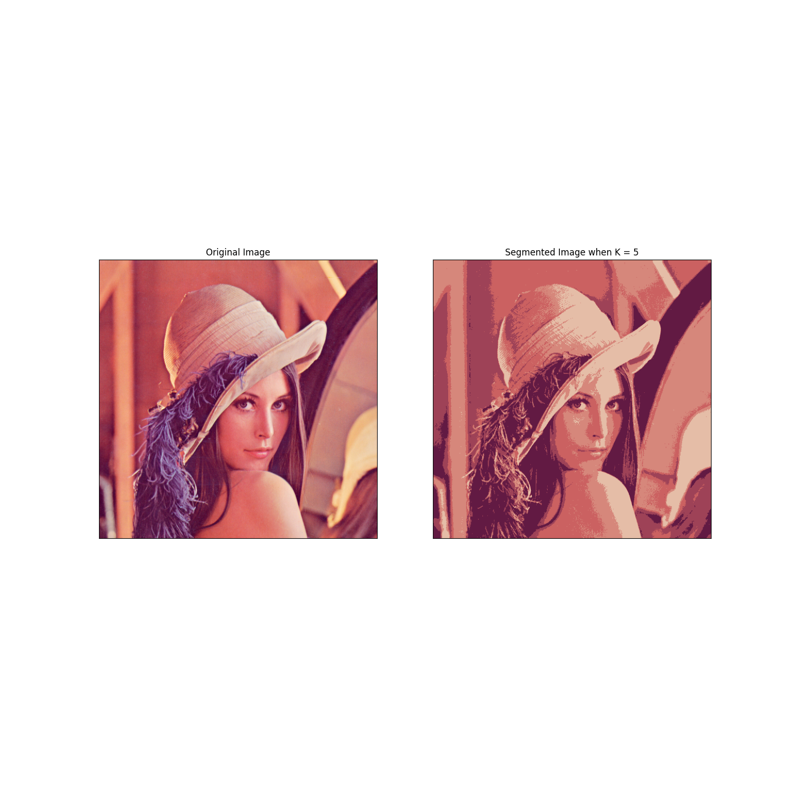

В данной папке реализована модель метода кластеризации к-средних.

Файл Funks.py содержит некоторые формулы, которые нам необходимы для
достижения результата. Объект из этого файла помогает получать вектора
точек с изображения.

Файл kmeans.py содержит, непосредственно, саму модель метода.

Файл runner.py необходим для запуска работы метода, ввод руками 
количества кластеров и сохранения результата в папку с результатами.

Например:
